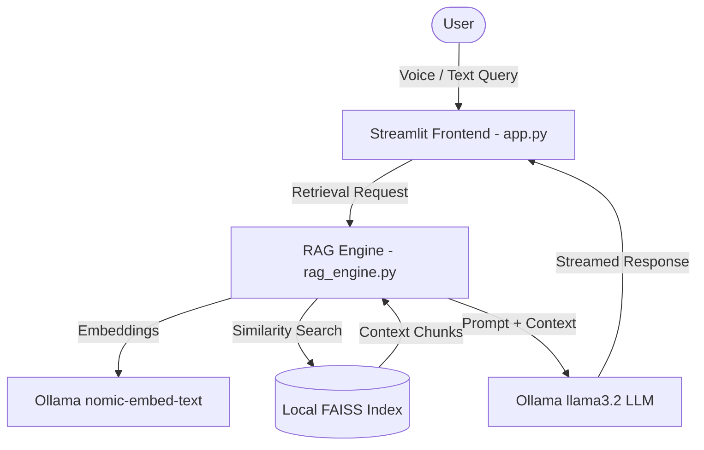

# 📄 LLM-Powered RAG Document Intelligence System

A privacy-focused Retrieval-Augmented Generation (RAG) web application built with **Streamlit**, **LangChain**, **FAISS**, and **Ollama**. Analyze, query, summarize, and compare private PDF documents offline using local LLMs.

---

## 🌟 Key Features

* **🏠 Interactive Assistant Room**:
  * Real-time streaming answers powered by local Ollama LLMs (`llama3.2`).
  * Source citations with exact page numbers and retrieved context excerpts.
  * **🎤 Speech-to-Text**: Voice recording via `st.audio_input` transcribed with Python `SpeechRecognition`.
  * **🔊 Text-to-Speech**: Listen to answers aloud using native browser speech synthesis.
  * **📌 Pin Answers**: Save key responses to a dedicated sidebar drawer.
  * **⭐ Starred Conversations**: Name and save chat sessions for future reference.
  * **📥 Export Chat**: Download active chat history in `.txt` or `.md` format.

* **📁 Advanced Document Manager**:
  * **Dynamic Question Suggestions**: Automatic topic-based questions that instantly redirect and query the Assistant Room on click.
  * **Document Versioning**: Tracks document iterations (`v1`, `v2`, etc.) automatically upon re-upload.
  * **📷 Image Extraction**: Extracts embedded images page-by-page from PDFs into an interactive gallery.
  * **🧠 Entity Knowledge Graph**: Visualizes extracted relationships using interactive **Vis.js** network nodes.
  * **📊 Data Metric Charts**: Parses numeric facts and renders interactive bar charts.
  * **✍️ Page Bookmarks & Notes**: Save custom notes tagged with page numbers.

* **📄 Side-by-Side Document Comparison**:
  * Select two documents or versions to stream a comparative analysis table.

* **👥 Team Collaborative Chat**:
  * Local shared channel allowing real-time messaging across multiple browser tabs.

---

## 🛠️ System Architecture



---

## 📁 Project Structure

```
rag_based_doc-main/
│
├── app.py                # Main Streamlit web application & UI components
├── rag_engine.py         # RAG pipeline, semantic chunking, FAISS indexing & Ollama connector
├── requirements.txt      # Python dependencies
├── .env.example          # Environment variable template
├── .gitignore            # Git exclusion rules for virtualenv and local vector data
└── vectorstore/          # Auto-created local directory for indexes, metadata, and extracted images
```

---

## 📋 Prerequisites

1. **Python**: Python 3.10, 3.11, or 3.12 installed.
2. **Ollama**: Download and install [Ollama](https://ollama.com/).

Before launching the app, pull the required models in your terminal:
```bash
ollama pull llama3.2
ollama pull nomic-embed-text
```

---

## 🚀 Quick Start Guide

### 1. Clone & Set Up Environment

```bash
# Windows (PowerShell)
python -m venv .venv
.\.venv\Scripts\activate

# macOS / Linux
python3 -m venv .venv
source .venv/bin/activate
```

### 2. Install Dependencies

```bash
pip install -r requirements.txt
```

### 3. Launch Application

```bash
streamlit run app.py
```

Open your browser at **[http://localhost:8501](http://localhost:8501)** to start using the system!

---

## ⚙️ Configuration & Settings

Use the sidebar panel to customize retrieval parameters:
* **Ollama Endpoint URL**: Defaults to `http://localhost:11434`.
* **LLM Model**: Select between `llama3.2`, `llama3`, `mistral`, or `gemma2`.
* **Embedding Model**: Select between `nomic-embed-text` or `all-minilm`.
* **LLM Temperature**: Adjust response creativity (0.0 to 1.0).
* **Top-K Chunks**: Control how many relevant document chunks are retrieved for each query (1 to 10).
* **Search Scope**: Query all indexed documents simultaneously or restrict search to selected files.

---

## 💡 How Dynamic Suggestions Work

In the **Document Manager** tab:
1. When a PDF is processed, AI highlights and 3 dynamic suggested questions are generated.
2. Click any suggested question button.
3. The app automatically switches to **Assistant Room**, enters the question into the chat, and streams the answer using RAG retrieval.

---

## ☁️ Deployment Guide

### Option 1: Streamlit Community Cloud (Free & Easy)

1. **Push to GitHub**:
   Upload your codebase (`app.py`, `rag_engine.py`, `requirements.txt`, `Dockerfile`, `.gitignore`, `README.md`) to a public or private GitHub repository.

2. **Deploy on Streamlit Cloud**:
   * Visit [share.streamlit.io](https://share.streamlit.io/).
   * Click **New App**, connect your GitHub repo, select main branch, set `app.py` as the entry file, and click **Deploy**.

3. **Expose Local Ollama Endpoint (for Cloud App Access)**:
   Since Streamlit Cloud runs in the cloud, `http://localhost:11434` cannot connect to your laptop directly. Expose your local Ollama port via **Ngrok**:
   ```bash
   ngrok http 11434
   ```
   Copy the generated forwarding URL (e.g. `https://xxxx.ngrok-free.app`) and paste it into the **Ollama Endpoint URL** input box in your deployed app's sidebar!

---

### Option 2: Docker Container Deployment

Build and run using Docker:
```bash
docker build -t rag-document-intelligence .
docker run -p 8501:8501 rag-document-intelligence
```

---

## 📝 License

This project is open-source and available under the [MIT License](LICENSE).

