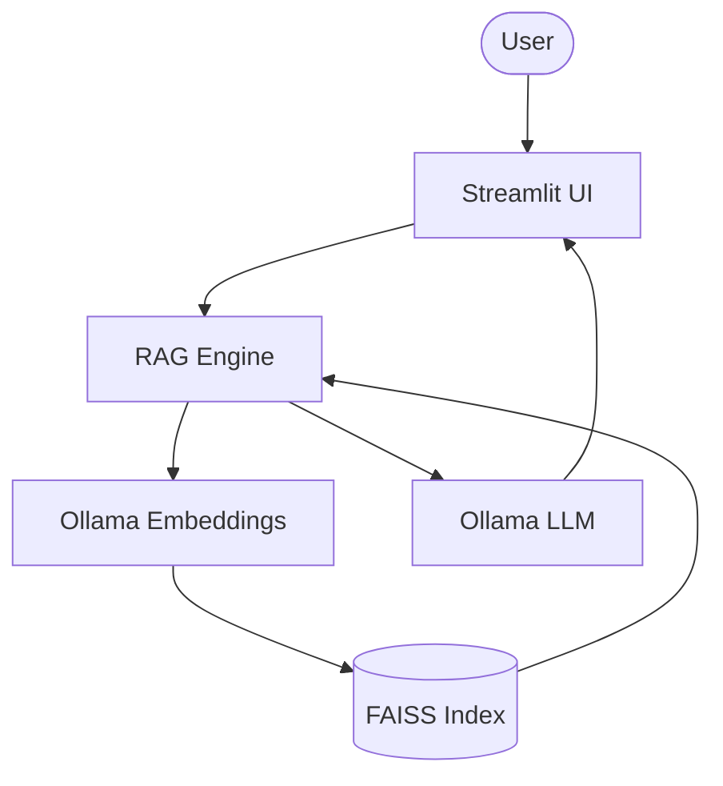

# 📄 LLM-Powered RAG Document Intelligence System

A privacy-focused **Retrieval-Augmented Generation (RAG)** application built with **Streamlit**, **LangChain**, **FAISS**, and **Ollama**. The system enables users to upload PDF documents, ask natural language questions, generate summaries, compare multiple documents, and visualize extracted insights while keeping all LLM inference on a locally running Ollama server.

---

## 🌐 Live Demo

- **Streamlit App:** https://rag-doc-ai.streamlit.app/
- **GitHub Repository:** https://github.com/dhruvrajzala200/rag_based_doc-final

---

## ✨ Features

### 🏠 Interactive Assistant Room
- 🤖 Real-time streaming responses using **llama3.2**
- 📚 Source citations with page numbers
- 🎤 Speech-to-Text (SpeechRecognition)
- 🔊 Text-to-Speech
- 📌 Pin important answers
- ⭐ Save & star conversations
- 📥 Export chats (.txt / .md)

### 📁 Advanced Document Manager
- AI-generated question suggestions
- Automatic document versioning
- PDF image extraction
- Entity Knowledge Graph (Vis.js)
- Numeric data visualization
- Page bookmarks & notes

### 📄 Document Comparison
- Compare two PDFs side-by-side using RAG.

### 👥 Team Chat
- Local collaborative discussion channel.

---

## 🛠️ Tech Stack

- Python
- Streamlit
- LangChain
- Ollama
- FAISS
- PyMuPDF
- SpeechRecognition
- Plotly
- Vis.js

---

## 🏗️ Architecture



---

## 📁 Project Structure

```text
rag_based_doc-main/
│
├── app.py
├── rag_engine.py
├── requirements.txt
├── README.md
├── .env.example
├── .gitignore
└── vectorstore/
```

---

## 📋 Prerequisites

- Python 3.10+
- Ollama

Install models:

```bash
ollama pull llama3.2
ollama pull nomic-embed-text
```

---

## 🚀 Local Installation

```bash
git clone https://github.com/dhruvrajzala200/rag_based_doc-final.git

cd rag_based_doc-final

python -m venv .venv

# Windows
.venv\Scripts\activate

# Linux/macOS
source .venv/bin/activate

pip install -r requirements.txt

streamlit run app.py
```

---

## ⚙️ Configuration

Sidebar settings include:

- Ollama Endpoint URL
- LLM Model
- Embedding Model
- Temperature
- Top-K Retrieval
- Search Scope

---

# ☁️ Deploy on Streamlit Community Cloud

## Step 1 — Push to GitHub

Push your project to GitHub.

---

## Step 2 — Deploy

1. Open https://share.streamlit.io
2. Click **New App**
3. Select your repository.
4. Choose `app.py`
5. Deploy.

---

## Step 3 — Install Ollama

```bash
ollama pull llama3.2
ollama pull nomic-embed-text
```

Start Ollama:

```bash
ollama serve
```

Verify:

```bash
curl http://localhost:11434/api/version
```

---

## Step 4 — Install Cloudflared

Download:

https://developers.cloudflare.com/cloudflare-one/connections/connect-networks/downloads/

Verify:

```bash
cloudflared --version
```

---

## Step 5 — Create Cloudflare Tunnel

Run:

```bash
cloudflared tunnel --url http://localhost:11434 --http-host-header="localhost:11434"
```

Example output:

```text
https://your-name.trycloudflare.com
```

> Keep this terminal running.

---

## Step 6 — Verify Tunnel

```bash
curl https://your-name.trycloudflare.com/api/version
```

Expected:

```json
{"version":"0.32.1"}
```

Check models:

```bash
curl https://your-name.trycloudflare.com/api/tags
```

---

## Step 7 — Connect Streamlit App

Open the deployed application.

In the sidebar, locate:

**Ollama Endpoint URL**

Paste:

```text
https://your-name.trycloudflare.com
```

⚠️ Do **NOT** append `/api`.

---

## Troubleshooting

### 403 Forbidden

Start the tunnel with:

```bash
cloudflared tunnel --url http://localhost:11434 --http-host-header="localhost:11434"
```

Without `--http-host-header`, Ollama may reject requests with **403 Forbidden**.

---

## 🐳 Docker

```bash
docker build -t rag-document-intelligence .
docker run -p 8501:8501 rag-document-intelligence
```

---

## 🚀 Future Enhancements

- Authentication
- Multi-user support
- Cloud vector database
- OCR support
- Multi-modal document understanding

---

## 🤝 Contributing

Contributions are welcome! Fork the repository, create a feature branch, and submit a pull request.

---

## 📄 License

MIT License.

---

## 👨‍💻 Author

**Dhruvrajsinh Zala**

- GitHub: https://github.com/dhruvrajzala200
- LinkedIn: www.linkedin.com/in/dhruvrajsinh-zala-5bb78b289


